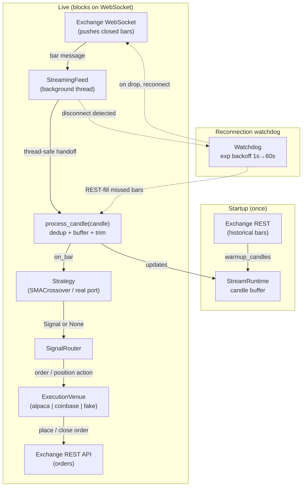

# Trading Bot — Design V3 (Alpaca + Coinbase Pivot)

**Date:** 2026-07-04
**Status:** Active
**Owner:** <anvarnosirov98@gmail.com>
**Supersedes:** Bybit-centric V2 approach

## 1. Purpose

Build a single Python process that:

1. Pulls market data.
2. Runs a Python strategy on closed bars.
3. Routes signals to a real exchange venue adapter.
4. Places/close orders visible in the selected account.

Primary venues for this milestone:

- **Alpaca** (paper by default — genuine risk-free sandbox)
- **Coinbase Advanced Trade** (sandbox host available for integration testing;
  production is real money)

## 2. Why this pivot

The previous Bybit target was region-restricted for this project owner, which
blocked both execution and practical datafeed validation. The project now
targets venues with account access already available to the owner. Bybit code
and the old webhook design have been removed from the repository.

### Venue reality (must stay accurate)

- **Alpaca:** `alpaca-py`; paper trading via `ALPACA_PAPER=true` is a genuine
  risk-free sandbox with real simulated fills. Alpaca crypto is spot,
  long/flat, symbol format `BTC/USD`.
- **Coinbase:** `coinbase-advanced-py`. `COINBASE_SANDBOX=true` switches the
  RESTClient to the Coinbase Advanced Trade sandbox host
  (`api-sandbox.coinbase.com`) via the SDK's `base_url` kwarg. The sandbox
  returns **static/mocked** responses in the production format for the Accounts
  and Orders endpoints — good for integration testing of request/response
  wiring, but **not** realistic fills or PnL. `COINBASE_SANDBOX=false` hits
  production `api.coinbase.com` and moves real money. Coinbase spot is long/flat
  only (no shorting); `get_position` is derived from the account base-asset
  balance and `entry_price` is `0.0`.

## 3. Scope (current milestone)

In scope:

- Exchange-agnostic architecture: `DataFeed -> Strategy -> Router -> ExecutionVenue`
- Venue adapters: Alpaca + Coinbase
- End-to-end runtime loop
- Spot execution baseline with clear long/flat semantics
- Unit + integration-style tests for adapters and routing behavior

Out of scope (deferred):

- Futures/perpetual specific semantics
- Advanced risk engine and portfolio optimizer
- Persistent storage/event sourcing
- Cloud deployment/ops hardening

## 4. Architecture

```text
DataFeed (exchange market data)
    -> Strategy (on closed bars, deterministic)
        -> Signal
            -> Router
                -> ExecutionVenue (alpaca | coinbase | fake)
                    -> Exchange API
```

Core rule: Router and runtime depend only on interfaces, not concrete exchange
SDK classes.

## 4a. Execution Model: Event-Driven Streaming (v2)

> Implementation plan: [doc/websocket-streaming-plan.md](doc/websocket-streaming-plan.md)

The v1 execution model keeps the process alive with `run_forever()`, a
`while True: run_once(); sleep(n)` loop that *pulls* the latest closed bar over
REST on every tick. v2 shifts to an **event-driven** model: the process
**blocks on an exchange WebSocket** and wakes only when a closed bar is *pushed*
to it. This is not just a bot spinning a loop anymore — it is a long-lived
service reacting to a live market-data stream.

Same liveness, less waste: no rate-limit-burning empty polls, lower latency to
signal, and an explicit place to handle disconnects and missed bars.

Key changes:

- The decision logic inside `run_once()` is extracted into a pure
  `process_candle(candle) -> OrderResult | None` (dedup → buffer → strategy →
  router; no I/O), which the stream invokes on each pushed bar.
- **`run_forever()` is being retired.** The busy polling loop is removed.
  `run_once()` stays for cron / single-shot use.
- A new `StreamingFeed` protocol (`warmup_candles` + `on_bar(handler)` +
  `run()` + `stop()`) is implemented by `AlpacaStreamFeed` and
  `CoinbaseStreamFeed`, each running its WebSocket on a background thread with a
  thread-safe handoff to the handler.
- A `StreamRuntime` warms up once (REST historical → buffer), registers
  `process_candle` as the `on_bar` callback, then blocks on the stream. Strategy,
  router, and venues are untouched.
- A reconnection watchdog reconnects with exponential backoff (1s → 60s) and
  REST-fills bars missed during the outage before resuming the stream.

### System flow



## 5. Components

- `config.py`

  - Venue selector and per-venue credentials/settings.
  - Fail-fast validation for selected venue credentials.

- `models.py`

  - Shared models/enums for candles, signals, orders, positions, results.

- `venues/base.py`

  - `ExecutionVenue` protocol.

- `venues/fake.py`

  - Deterministic in-memory test venue.

- `venues/alpaca.py`

  - Alpaca adapter (`from_credentials(api_key, api_secret, paper=True)`).

- `venues/coinbase.py`

  - Coinbase adapter (`from_credentials(api_key, api_secret, sandbox=True)`;
    `sandbox=True` selects the sandbox host `api-sandbox.coinbase.com`).

- `datafeed.py`

  - Currently provides `InMemoryCandleFeed`, a `CandleFeed` protocol, and
    `normalize_candle()`. A **live** market-data feed for Alpaca/Coinbase is
    **not yet implemented** (known gap for a real end-to-end run).

- `strategy.py`

  - `SMACrossoverStrategy` placeholder (configurable fast/slow SMA lengths;
    deterministic). Real strategy port later.

- `router.py`

  - `SignalRouter`: signal → order/position actions.

- `runtime.py` + `__main__.py`

  - `BotRuntime` app wiring and run loop. `RUN_FOREVER=1` loops; otherwise a
    single `run_once`. Because the default feed is in-memory/empty, running
    `__main__` as-is does not yet fetch live data.

## 6. Execution semantics

For this milestone, default behavior is spot-safe:

- `buy` => increase/open long
- `sell` (from long) => reduce/close long
- `close` => flatten current position

No leverage-specific assumptions are made.

## 7. Data and strategy behavior

- Act on **closed bars** only.
- Keep strategy deterministic and testable with candle fixtures.
- Strategy implementation can be replaced later without changing router/runtime.

## 8. Error handling

- Missing/invalid credentials for selected venue: fail fast at startup.
- Venue/API action failures: return structured `OrderResult` with `ok=False` and
  preserve raw response when available.
- Runtime loop should continue safely on transient data/venue errors.

## 9. Testing strategy

- Unit tests for config/model/router logic.
- Venue adapter tests with mocked SDK/client responses.
- Runtime integration test with `FakeVenue` + canned candles.
- All 54 tests use mocks/fakes; no live network access.
- Optional live smoke checks for Alpaca paper (Coinbase would be real money)
  become possible once the live datafeed is implemented.

## 10. Milestone completion definition

The base bot is considered wrapped up when:

- Datafeed supplies bars continuously.
- Strategy emits signals from those bars.
- Router converts signals into venue actions.
- Orders are executed through selected venue API and visible in the venue account.

### Current status

Venue adapters (Alpaca, Coinbase), the strategy placeholder, router, runtime,
and the in-memory datafeed are implemented and tested. The remaining gap is a
**live datafeed** (Alpaca/Coinbase market data) so the end-to-end loop can pull
real bars. Until then, the app wiring runs against an empty in-memory feed.
